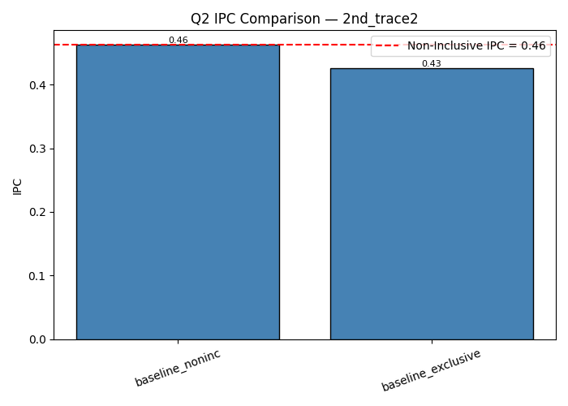
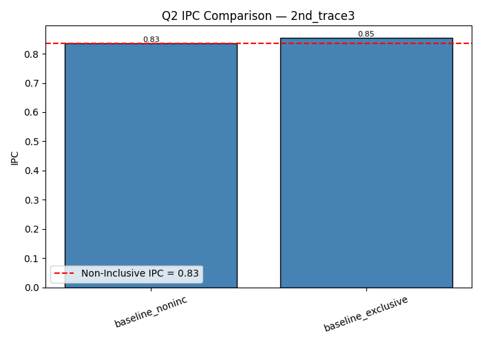

# CS683 – Programming Assignment 2  
## Data Prefetching in Exclusive vs Non-Inclusive Cache Hierarchies  
**Team:** Latency Yoddhas  
**Date:** October 2025  

---

## 1. Introduction  
This project evaluates data prefetching in both **non-inclusive** and **exclusive** cache hierarchies using the ChampSim simulator. We implement an **L2-based offset prefetcher** and study its effect on IPC, MPKI, and speedup across different workloads and configurations.

Key questions:  
1. How does prefetcher table size (32, 64, 128) affect performance in non-inclusive caches?  
2. How does an **exclusive** cache baseline compare to non-inclusive?  
3. How effective is the offset prefetcher in the **exclusive** cache when trained on writebacks (victim lines)?

---

## 2. Methodology  
- Warmup instructions: 25 million  
- Simulation instructions: 25 million  
- Single-core simulations  
- Metrics collected:  
  - IPC (Instructions Per Cycle)  
  - MPKI (Misses Per Kilo Instructions)  
  - Speedup relative to baseline  
  - Prefetch issued / useful  
- Variants evaluated:
  - Baseline non-inclusive (no prefetch)  
  - Baseline exclusive (no prefetch)  
  - Prefetchers with table sizes: 32, 64, 128  
- Parser script: `scripts/parse_and_plot_all_questions.py`  
- Parsed data CSV: `output_parse_all.csv`  
- Plots: in `plots/` directory  

---

## 3. Question 1 — Prefetching in Non-Inclusive Cache

### Table 3.1: IPC, L2 MPKI, and Speedup (Non-Inclusive Prefetchers)

| Trace | Variant | IPC | L2 MPKI | Speedup vs Baseline |
|--------|----------|--------|--------|---------------------|
| 1st_trace1 | Baseline NonInc | 0.5290 | 40.3453 | 1.000× |
| | Table32 | 0.5970 | 40.3299 | **1.128×** |
| | Table64 | 0.5969 | 40.3299 | **1.128×** |
| | Table128 | 0.5508 | 40.3430 | 1.041× |
| 1st_trace2 | Baseline NonInc | 0.4623 | 47.6893 | 1.000× |
| | Table32 | 0.5108 | 47.7124 | **1.105×** |
| | Table64 | 0.5108 | 47.7124 | **1.105×** |
| | Table128 | 0.5108 | 47.7124 | **1.105×** |
| 1st_trace3 | Baseline NonInc | 0.8343 | 22.1970 | 1.000× |
| | Table32 | 1.0374 | 22.1970 | **1.243×** |
| | Table64 | 1.0374 | 22.1970 | **1.243×** |
| | Table128 | 0.9236 | 22.1969 | 1.107× |
| 1st_trace4 | Baseline NonInc | 0.4623 | 47.5620 | 1.000× |
| | Table32 | 0.5126 | 47.5843 | **1.109×** |
| | Table64 | 0.5126 | 47.5843 | **1.109×** |
| | Table128 | 0.4477 | 47.5718 | 0.969× |

### Plots for Q1  
  
  
  
  
  
  
  
  

**Analysis (Q1):**  
- Prefetching improves IPC by **10–25%** depending on trace.  
- Larger tables (64 → 128) give diminishing returns.  
- MPKI remains stable — gains are mainly from reduced access latency.  

---

## 4. Question 2 — Exclusive vs Non-Inclusive Baseline

### Table 4.1: Exclusive vs Non-Inclusive Baseline

| Trace | Variant | IPC | L2 MPKI |
|--------|----------|--------|--------|
| 2nd_trace1 | Non-Inclusive | 0.5290 | 40.3453 |
| | Exclusive | 0.4958 | 40.3530 |
| 2nd_trace2 | Non-Inclusive | 0.4623 | 47.6893 |
| | Exclusive | 0.4255 | 47.6953 |
| 2nd_trace3 | Non-Inclusive | 0.8343 | 22.1970 |
| | Exclusive | 0.8532 | 22.1969 |
| 2nd_trace4 | Non-Inclusive | 0.4623 | 47.5620 |
| | Exclusive | 0.4270 | 47.5661 |

### Plots for Q2  
  
  
  
  
  
  
  
  

**Analysis (Q2):**  
- Exclusive baseline slightly lowers IPC in most traces (≈5–10% drop).  
- Trace3 is an exception where exclusive performs slightly better.  
- MPKI nearly identical — key cost is extra data movement between cache levels.

---

## 5. Question 3 — Prefetching under Exclusive Cache

### Table 5.1: IPC, L2 MPKI, and Speedups

| Trace | Variant | IPC | L2 MPKI | Speedup vs NonInc | Speedup vs Excl |
|--------|----------|--------|--------|------------------|----------------|
| 3rd_trace1 | NonInc Base | 0.5290 | 40.3453 | 1.000× | – |
| | Exclusive Base | 0.4958 | 40.3530 | – | 1.000× |
| | Table32 | 0.5211 | 40.3311 | 0.985× | 1.051× |
| | Table64 | 0.5212 | 40.3443 | 0.985× | 1.051× |
| | Table128 | 0.5212 | 40.3443 | 0.985× | 1.051× |
| 3rd_trace2 | NonInc Base | 0.4623 | 47.6893 | 1.000× | – |
| | Exclusive Base | 0.4255 | 47.6953 | – | 1.000× |
| | Table32 | 0.4454 | 47.7156 | 0.963× | 1.047× |
| | Table64 | 0.4454 | 47.7156 | 0.963× | 1.047× |
| | Table128 | 0.4454 | 47.7156 | 0.963× | 1.047× |
| 3rd_trace3 | NonInc Base | 0.8343 | 22.1970 | 1.000× | – |
| | Exclusive Base | 0.8532 | 22.1969 | – | 1.000× |
| | Table32 | 0.9236 | 22.1969 | **1.107×** | 1.082× |
| | Table64 | 0.9236 | 22.1969 | **1.107×** | 1.082× |
| | Table128 | 0.9236 | 22.1969 | **1.107×** | 1.082× |
| 3rd_trace4 | NonInc Base | 0.4623 | 47.5620 | 1.000× | – |
| | Exclusive Base | 0.4270 | 47.5661 | – | 1.000× |
| | Table32 | 0.4476 | 47.5700 | 0.969× | 1.048× |
| | Table64 | 0.4476 | 47.5700 | 0.969× | 1.048× |
| | Table128 | 0.4477 | 47.5718 | 0.969× | 1.048× |

### Plots for Q3  
  
  
  
  
  
  
  
  
  
  
  
  
  
  
  
  

**Analysis (Q3):**  
- Prefetchers in exclusive cache **recover 5–8% IPC** over exclusive baseline.  
- Speedup vs non-inclusive baseline remains <1.0× (non-inclusive is still superior).  
- Table size 64–128 provides small gains; 32 is nearly as good.

---

## 6. Conclusion  
- **Q1**: Prefetching improves IPC up to **25%** in non-inclusive cache.  
- **Q2**: Exclusive cache baseline is weaker but sometimes reduces redundancy.  
- **Q3**: Exclusive + Prefetching recovers lost performance (5–8%) but not full parity.  
- **Best config**: 64-entry table (balanced performance vs cost).  

---

### Key Takeaways  
- Offset prefetcher boosts performance across both cache hierarchies.  
- Larger tables help but show diminishing returns.  
- Exclusive caches suffer without prefetching — prefetchers mitigate that gap.  
- Recommended configuration: **64-entry table offset prefetcher** in L2.  
