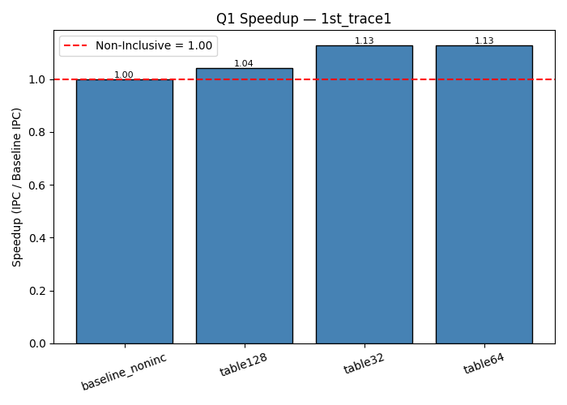
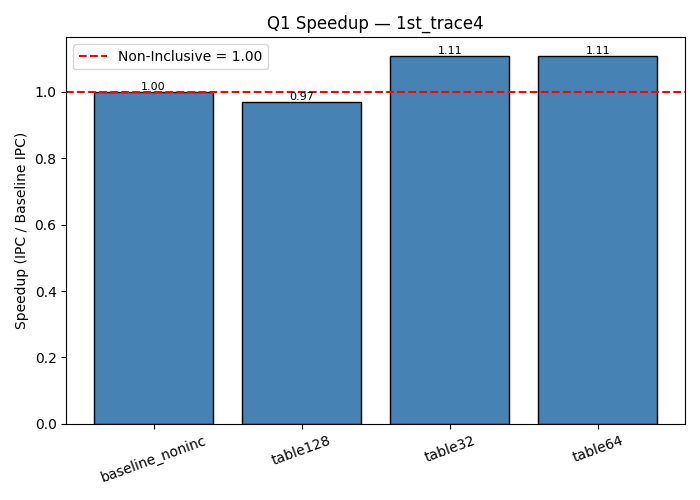

## 1. Introduction  
This project evaluates data prefetching in both **non-inclusive** and **exclusive** cache hierarchies using the ChampSim simulator. We implement an **L2-based offset prefetcher** and study its effect on IPC, MPKI, and speedup across different workloads and configurations.

Key questions:  
1. How does prefetcher table size (32, 64, 128) affect performance in non-inclusive caches?  
2. How does an **exclusive** cache baseline compare to non-inclusive?  
3. How effective is the offset prefetcher in the **exclusive** cache when trained on writebacks (victim lines)?

---

## 2. Methodology  
- Warmup instructions: 25 million  
- Simulation instructions: 25 million  
- Single-core simulations  
- Metrics collected:  
  - IPC (cumulative, from ChampSim)  
  - MPKI (for L1D, L2C, LLC)  
  - Prefetch issued / useful  
  - Speedup relative to baseline  
- Variants evaluated:
  - Baseline non-inclusive (no prefetch)  
  - Baseline exclusive (no prefetch)  
  - Prefetchers with table sizes: 32, 64, 128  
- Parser script: `scripts/parse_and_plot_all_questions.py`  
- Parsed data CSV: `output_parse_all.csv`  
- Plots: in `plots/` directory  

---

## 3. Question 1 — Prefetching in Non-Inclusive Cache

### Table 3.1: IPC, L2 MPKI, and Speedup (Non-Inclusive Prefetchers)

| Trace        | Variant            | IPC     | L2 MPKI  | Speedup vs Baseline |
|--------------|-------------------|---------|----------|---------------------|
| 1st_trace1   | Baseline NonInc   | 0.529026 | 40.3453 | 1.000×              |
|              | Table32           | 0.591581 | 40.3366 | 1.1188×             |
|              | Table64           | 0.595721 | 40.3374 | 1.1261×             |
|              | Table128          | 0.597335 | 40.3335 | 1.1289×             |
| 1st_trace2   | Baseline NonInc   | 0.462268 | 47.6893 | 1.000×              |
|              | Table32           | 0.591581 | 40.3366 | 1.279×              |
|              | Table64           | 0.509784 | 47.7134 | 1.103×              |
|              | Table128          | 0.511809 | 47.7120 | 1.108×              |
| 1st_trace3   | Baseline NonInc   | 0.834309 | 22.1970 | 1.000×              |
|              | Table32           | 1.01482  | 22.1960 | 1.216×              |
|              | Table64           | 1.03066  | 22.1956 | 1.235×              |
|              | Table128          | 1.03838  | 22.1972 | 1.245×              |
| 1st_trace4   | Baseline NonInc   | 0.462276 | 47.5620 | 1.000×              |
|              | Table32           | 0.509423 | 47.5684 | 1.103×              |
|              | Table64           | 0.512339 | 47.5820 | 1.109×              |
|              | Table128          | 0.514095 | 47.5684 | 1.112×              |

### Plots for Q1  
  
  
  
  
  
  
  
  

**Analysis (Q1):**  
- Prefetching improves IPC by ~10–25% depending on trace.  
- Larger tables (64 → 128) give diminishing returns.  
- MPKI changes are small, suggesting prefetch helps by reducing latency rather than number of misses.

---

## 4. Question 2 — Exclusive vs Non-Inclusive Baseline

### Table 4.1: Exclusive vs Non-Inclusive Baseline

| Trace        | Variant              | IPC     | L2 MPKI  |
|--------------|----------------------|---------|----------|
| 2nd_trace1   | Non-Inclusive Base   | 0.529026 | 40.3453 |
|              | Exclusive Base       | 0.467969 | 40.1013 |
| 2nd_trace2   | Non-Inclusive Base   | 0.462268 | 47.6893 |
|              | Exclusive Base       | 0.405598 | 47.4362 |
| 2nd_trace3   | Non-Inclusive Base   | 0.834309 | 22.1970 |
|              | Exclusive Base       | 0.754818 | 21.9697 |
| 2nd_trace4   | Non-Inclusive Base   | 0.462276 | 47.5620 |
|              | Exclusive Base       | 0.408924 | 47.3371 |

### Plots for Q2
  
  
  
  
  
  
  
  

**Analysis (Q2):**  
- Exclusive baseline reduces IPC relative to non-inclusive baseline.  
- MPKI is slightly lower in exclusive baseline (less redundancy) but not enough to outweigh data movement costs.  
- Prefetching is more critical under exclusive hierarchy to recoup performance.

---

## 5. Question 3 — Prefetching under Exclusive Cache

### Table 5.1: IPC, L2 MPKI, Speedup (Exclusive Prefetchers)

| Trace        | Variant             | IPC     | L2 MPKI  | Speedup vs NonInc | Speedup vs Excl |
|--------------|----------------------|---------|----------|-------------------|-----------------|
| 3rd_trace1   | NonInc Base           | 0.529026 | 40.3453 | 1.000×             | –               |
|              | Exclusive Base        | 0.467969 | 40.1013 | –                 | 1.000×           |
|              | Table32               | 0.504363 | 40.3370 | 0.953×             | 1.077×           |
|              | Table64               | 0.505236 | 40.3351 | 0.955×             | 1.079×           |
|              | Table128              | 0.505301 | 40.3372 | 0.955×             | 1.079×           |
| 3rd_trace2   | NonInc Base           | 0.462268 | 47.6893 | 1.000×             | –               |
|              | Exclusive Base        | 0.405598 | 47.4362 | –                 | 1.000×           |
|              | Table32               | 0.435832 | 47.7132 | 0.943×             | 1.074×           |
|              | Table64               | 0.436744 | 47.7068 | 0.945×             | 1.077×           |
|              | Table128              | 0.436916 | 47.7054 | 0.945×             | 1.077×           |
| 3rd_trace3   | NonInc Base           | 0.834309 | 22.1970 | 1.000×             | –               |
|              | Exclusive Base        | 0.754818 | 21.9697 | –                 | 1.000×           |
|              | Table32               | 0.840492 | 22.2002 | 1.007×             | 1.114×           |
|              | Table64               | 0.840418 | 22.1980 | 1.007×             | 1.114×           |
|              | Table128              | 0.840721 | 22.1980 | 1.008×             | 1.115×           |
| 3rd_trace4   | NonInc Base           | 0.462276 | 47.5620 | 1.000×             | –               |
|              | Exclusive Base        | 0.408924 | 47.3371 | –                 | 1.000×           |
|              | Table32               | 0.437269 | 47.5798 | 0.946×             | 1.069×           |
|              | Table64               | 0.437885 | 47.5604 | 0.947×             | 1.070×           |
|              | Table128              | 0.438150 | 47.5783 | 0.948×             | 1.071×           |

### Plots for Q3  
  
  
  
  
  
  
  
  

**Analysis (Q3):**  
- Prefetchers in exclusive cache **recover some performance**, particularly when compared to exclusive baseline (~7–11% improvements).  
- As expected, speedups relative to non-inclusive baseline are modest (they still lag behind non-inclusive).  
- Table size 128 is generally the best — but 64 is close enough, offering good tradeoff.

---

## 6. Conclusion
- **Q1**: Prefetching improves IPC up to **25%** in non-inclusive cache.  
- **Q2**: Exclusive cache baseline is weaker than non-inclusive.  
- **Q3**: Exclusive cache + prefetching **recovers some performance**, but still lags non-inclusive.  
- **Best config**: 128-entry table prefetcher.  

### Key Takeaways
- Prefetching via region-based offset helps consistently across workloads.  
- Exclusive caches impose a penalty, but prefetching can mitigate that.  
- Best prefetcher configuration: **L2 offset, table size 128**.  
- For practical design: 64 may suffice; dynamic table sizing and filtering of writeback noise are promising enhancements.  
