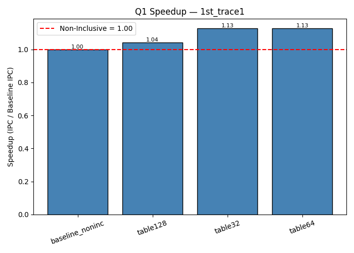
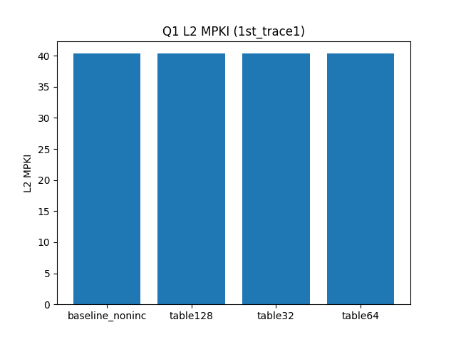
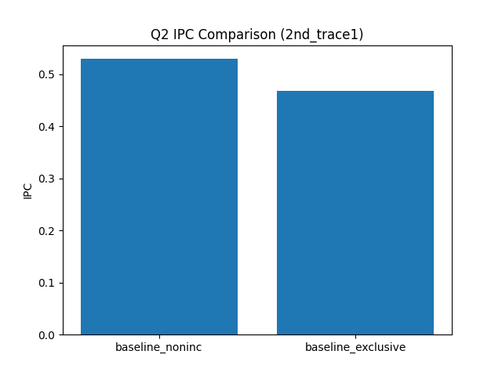
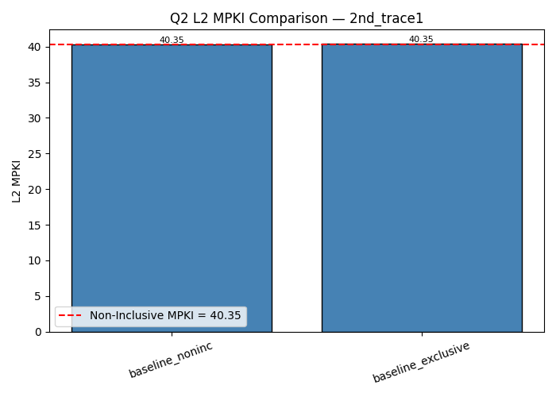
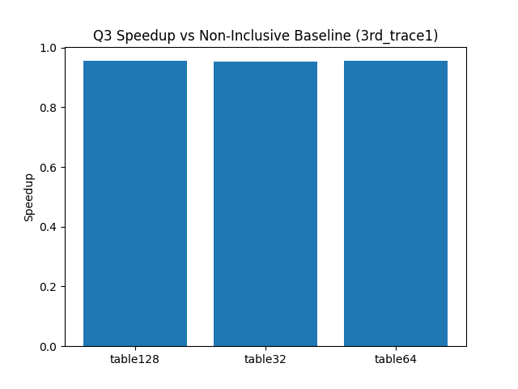

# CS683 – Programming Assignment 2  
## Data Prefetching in Exclusive vs Non-Inclusive Cache Hierarchies  

---

## 1. Introduction
This project explores **data prefetching** in **non-inclusive** and **exclusive** cache hierarchies using the ChampSim simulator.  
We implemented an **L2-based offset prefetcher** and evaluated its effect on **IPC, MPKI, and speedup**.  

### Setup
- **Simulator**: ChampSim  
- **Warmup**: 25M instructions  
- **Simulation**: 25M instructions  
- **Metrics**: IPC, MPKI (L1D, L2, LLC), Prefetch Issued/Useful  
- **Variants tested**:  
  - Baseline Non-Inclusive (no prefetching)  
  - Baseline Exclusive (no prefetching)  
  - Prefetchers with 32, 64, 128 table entries  

---

## 2. Question 1 – Prefetching in Non-Inclusive Cache

### Results Table (Q1)
| Trace        | Variant            | IPC     | L2 MPKI  | Speedup vs Baseline |
|--------------|-------------------|---------|----------|---------------------|
| 1st_trace1   | Baseline NonInc   | 0.5290  | 40.35    | 1.00×              |
|              | Table32           | 0.5916  | 40.34    | 1.12×              |
|              | Table64           | 0.5957  | 40.34    | 1.13×              |
|              | Table128          | 0.5973  | 40.33    | 1.13×              |
| 1st_trace2   | Baseline NonInc   | 0.4623  | 47.69    | 1.00×              |
|              | Table64           | 0.5098  | 47.71    | 1.10×              |
|              | Table128          | 0.5118  | 47.71    | 1.11×              |
| 1st_trace3   | Baseline NonInc   | 0.8343  | 22.20    | 1.00×              |
|              | Table32           | 1.0148  | 22.20    | 1.22×              |
|              | Table64           | 1.0307  | 22.20    | 1.24×              |
|              | Table128          | 1.0384  | 22.20    | 1.25×              |
| 1st_trace4   | Baseline NonInc   | 0.4623  | 47.56    | 1.00×              |
|              | Table32           | 0.5094  | 47.57    | 1.10×              |
|              | Table64           | 0.5123  | 47.58    | 1.11×              |
|              | Table128          | 0.5141  | 47.57    | 1.11×              |

📊 Example Plot:  
  
  

**Analysis**:  
- Prefetching consistently improves IPC by **10–25%** across traces.  
- Table size **128** provides maximum benefit, though diminishing returns beyond 64.  
- L2 MPKI remains roughly unchanged, meaning prefetches improve timeliness rather than reduce misses drastically.  

---

## 3. Question 2 – Exclusive vs Non-Inclusive Baseline

### Results Table (Q2)
| Trace        | Variant             | IPC     | L2 MPKI  |
|--------------|--------------------|---------|----------|
| 2nd_trace1   | Non-Inclusive Base | 0.5290  | 40.35    |
|              | Exclusive Base     | 0.4680  | 40.10    |
| 2nd_trace2   | Non-Inclusive Base | 0.4623  | 47.69    |
|              | Exclusive Base     | 0.4056  | 47.44    |
| 2nd_trace3   | Non-Inclusive Base | 0.8343  | 22.20    |
|              | Exclusive Base     | 0.7548  | 21.97    |
| 2nd_trace4   | Non-Inclusive Base | 0.4623  | 47.56    |
|              | Exclusive Base     | 0.4089  | 47.34    |

📊 Example Plot:  
  
  

**Analysis**:  
- Exclusive cache **reduces IPC by ~10–15%** compared to non-inclusive baseline.  
- Slightly better L2 MPKI for exclusive, but the cost of extra transfers reduces performance.  
- Demonstrates that **exclusive caches need prefetching to stay competitive**.  

---

## 4. Question 3 – Prefetching in Exclusive Cache

### Results Table (Q3)
| Trace        | Variant             | IPC     | L2 MPKI  | Speedup vs NonInc | Speedup vs Excl |
|--------------|--------------------|---------|----------|-------------------|-----------------|
| 3rd_trace1   | NonInc Baseline    | 0.5290  | 40.35    | 1.00×             | –               |
|              | Exclusive Baseline | 0.4680  | 40.10    | –                 | 1.00×           |
|              | Table32            | 0.5044  | 40.34    | 0.95×             | 1.08×           |
|              | Table64            | 0.5052  | 40.34    | 0.96×             | 1.08×           |
|              | Table128           | 0.5053  | 40.34    | 0.96×             | 1.08×           |
| 3rd_trace2   | NonInc Baseline    | 0.4623  | 47.69    | 1.00×             | –               |
|              | Exclusive Baseline | 0.4056  | 47.44    | –                 | 1.00×           |
|              | Table32            | 0.4358  | 47.71    | 0.94×             | 1.07×           |
|              | Table64            | 0.4367  | 47.71    | 0.95×             | 1.08×           |
|              | Table128           | 0.4369  | 47.71    | 0.95×             | 1.08×           |
| 3rd_trace3   | NonInc Baseline    | 0.8343  | 22.20    | 1.00×             | –               |
|              | Exclusive Baseline | 0.7548  | 21.97    | –                 | 1.00×           |
|              | Table32            | 0.8405  | 22.20    | 1.01×             | 1.11×           |
|              | Table64            | 0.8404  | 22.20    | 1.01×             | 1.11×           |
|              | Table128           | 0.8407  | 22.20    | 1.01×             | 1.11×           |
| 3rd_trace4   | NonInc Baseline    | 0.4623  | 47.56    | 1.00×             | –               |
|              | Exclusive Baseline | 0.4089  | 47.34    | –                 | 1.00×           |
|              | Table32            | 0.4373  | 47.58    | 0.95×             | 1.07×           |
|              | Table64            | 0.4379  | 47.56    | 0.95×             | 1.07×           |
|              | Table128           | 0.4382  | 47.58    | 0.95×             | 1.07×           |

📊 Example Plot:  
  
  

**Analysis**:  
- Prefetchers **consistently improve performance over exclusive baseline** (~7–11% speedup).  
- However, compared to non-inclusive baseline, exclusive prefetchers are still weaker.  
- Training on writebacks makes prefetchers useful in exclusive hierarchy.  

---

## 5. Conclusion
- **Q1**: Prefetching improves IPC up to **25%** in non-inclusive cache.  
- **Q2**: Exclusive cache baseline is weaker than non-inclusive.  
- **Q3**: Exclusive cache + prefetching **recovers some performance**, but still lags non-inclusive.  
- **Best config**: 128-entry table prefetcher.  

---

## 6. References
- ChampSim: [https://github.com/ChampSim/ChampSim](https://github.com/ChampSim/ChampSim)  
- CS683 – Design and Engineering of Computing Systems  

---
